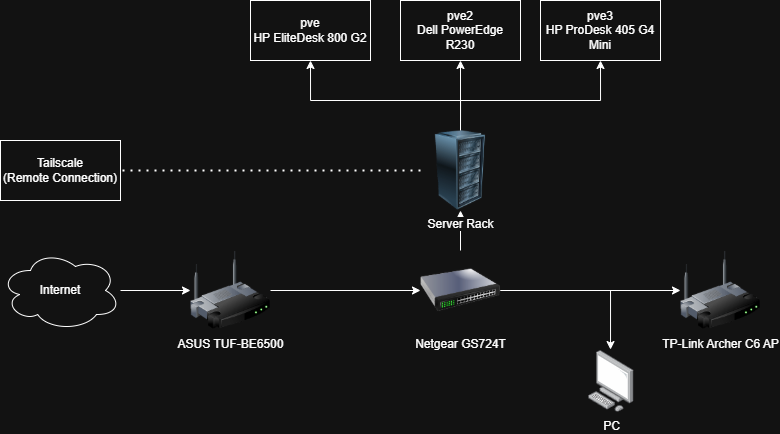
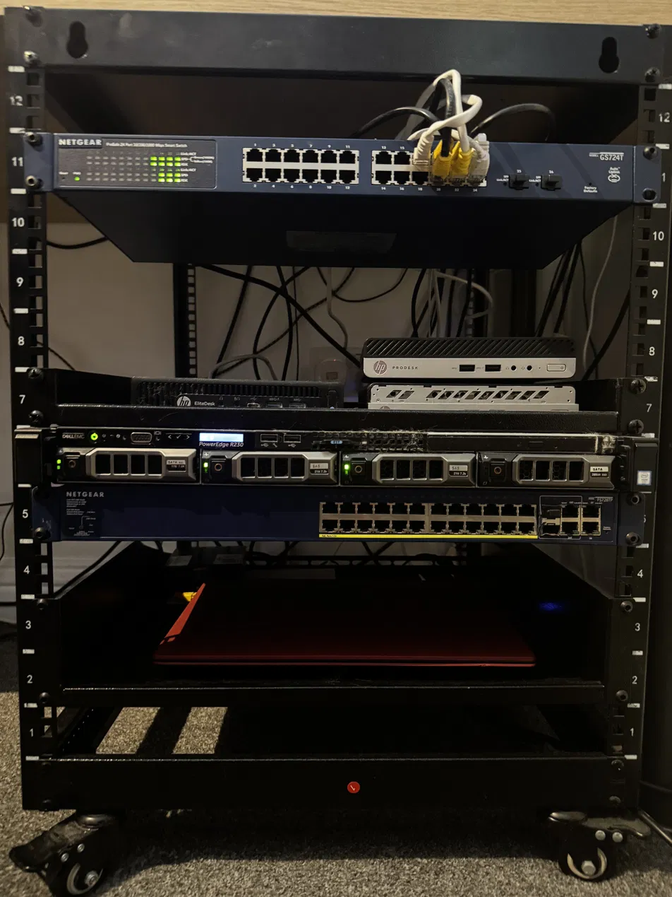

# 🏠 Homelab

A personal cybersecurity and self-hosting homelab I've been building and running since January 2024.
Used for hands-on learning, security research, and self-hosted services.

---

## 🖥️ Hardware

| Device | Specs | Role |
|--------|-------|------|
| HP EliteDesk 800 G2 | i5-6600T, 32GB RAM | Proxmox Node 1 (pve) |
| Dell PowerEdge R230 | Xeon E3-1270 v6, 32GB RAM, 2x 2TB HDD + 1TB HDD | Proxmox Node 2 (pve2) |
| HP ProDesk 405 G4 Mini | Ryzen 3 PRO 2200GE, 10GB RAM | Proxmox Node 3 (pve3) |
| Acer Aspire A314 | AMD A6-9220e, 8GB RAM, 128GB SSD | Permanent Kali Remote Desktop |
| HP ProDesk 400 G3 | i3-6100T, 8GB RAM, 128GB NVMe, 240GB SATA | Unused |
| Raspberry Pi 4 | 2GB RAM, PoE | Unused |
| Netgear GS724T | 24x 1G RJ45, 2x 1G SFP, L2+ Smart Managed, fanless | Core Switch |
| Netgear FS728TP v2 | 28-port PoE Smart Switch | Unused (in rack) |
| 12U Rack | - | Housing |

---

## 🔧 Services

| Service | Purpose |
|---------|---------|
| Proxmox VE | Hypervisor / VM & LXC management |
| Wazuh + ELK | SIEM / Security monitoring |
| Home Assistant | Home automation |
| Pi-hole | Network-wide ad blocking / DNS |
| TrueNAS Scale | Network attached storage |
| Tailscale | Remote access / VPN |
| Cloudflare Tunnel | Public service exposure |
| Minecraft | Game server |

---

## 🌐 Network

- 3 node Proxmox cluster
- Managed switching via Netgear GS724T
- Remote access via Tailscale (always-on)
- Public services via Cloudflare Tunnel + Zero Trust

---

## 🖥️ Virtual Machines & Containers

### pve (Node 1 — HP EliteDesk 800 G2)
| ID | Name | Type | Description |
|----|------|------|-------------|
| 101 | cloudflared-docker | LXC | Cloudflare tunnel Docker container |
| 106 | openclaw | LXC | OpenClaw AI agent |
| 107 | openclaw-workspace | LXC | Workspace environment for OpenClaw AI agent |
| 108 | pihole | LXC | Pi-hole network-wide ad blocking and DNS |
| 109 | docker-flask | LXC | Docker LXC for running small Flask applications |
| 111 | rustdeskserver | LXC | RustDesk self-hosted remote desktop server |
| 114 | tailscale | LXC | Tailscale exit node for remote access |
| 121 | pelican-panel | LXC | Pelican game server management panel |
| 102 | Win11-Client-02 | VM | Windows 11 virtual machine |
| 104 | Win11-Client-01 | VM | Windows 11 virtual machine |
| 112 | media-docker | VM | Media server stack (Jellyfin, Jellyseerr) |
| 119 | haos | VM | Home Assistant OS for home automation |
| 128 | megadocker | VM | Large Docker VM (16GB RAM) for heavier workloads |

### pve2 (Node 2 — Dell PowerEdge R230)
| ID | Name | Type | Description |
|----|------|------|-------------|
| 103 | ai-docker | LXC | Docker LXC for experimenting with Ollama and local LLMs |
| 115 | visua | LXC | Host for visua.cc community platform |
| 123 | pelican-wings | LXC | Pelican Wings daemon for game server hosting |
| 116 | truenas-scale | VM | TrueNAS Scale network attached storage |

### pve3 (Node 3 — HP ProDesk 405 G4 Mini)
| ID | Name | Type | Description |
|----|------|------|-------------|
| 100 | siem | LXC | Wazuh + ELK SIEM stack for security monitoring |
| 110 | fedora | LXC | Fedora LXC monitored by Wazuh for testing |
| 122 | dc01 | VM | Windows Server 2022 Active Directory domain controller (lab.local) |

---

## 📸 Screenshots

